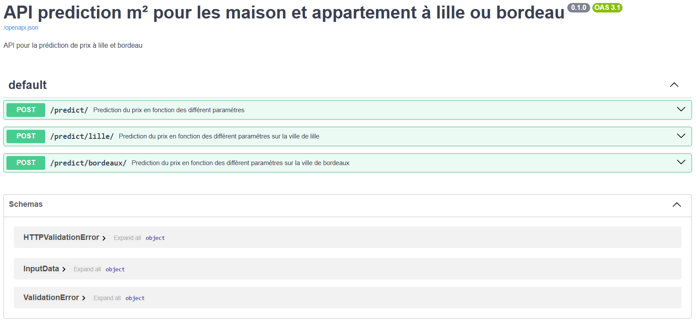
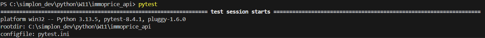
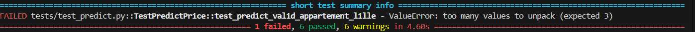
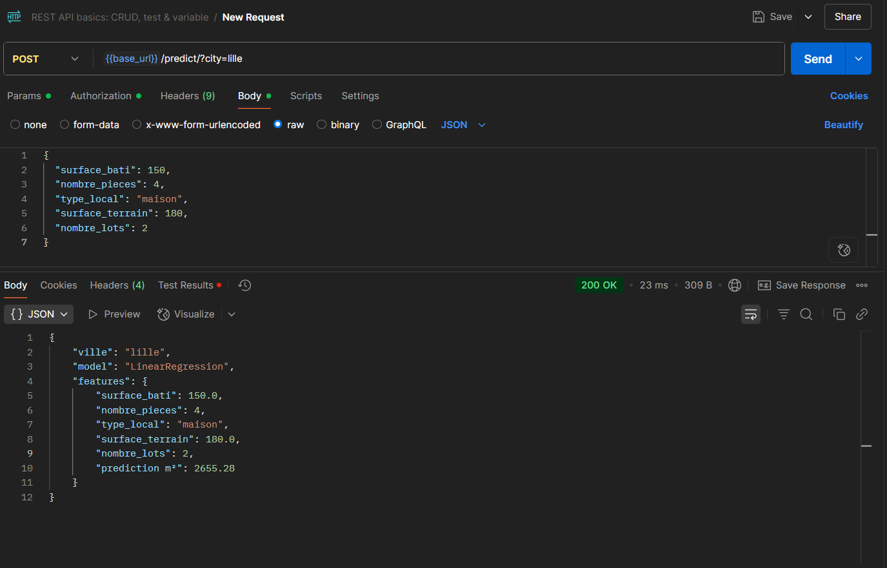

# 🏡 Estimation du prix au m² - Lille & Bordeaux



Projet de Data Science visant à prédire le **prix au m²** de biens immobiliers (maisons/appartements) dans deux villes françaises : **Lille** et **Bordeaux**.

---

## 📦 Installation

1. Cloner le dépôt :

```bash
git clone https://github.com/sayana-project/immoprice_api.git
cd immoprice_api
```

2. Créer un environnement virtuel (recommandé) :

```bash
python -m venv .venv
source .venv/bin/activate  # Linux/macOS
.venv\Scripts\activate     # Windows
```

3. Installer les dépendances :

```bash
pip install -r requirements.txt
```

4. Lancer l'API :

```bash
uvicorn app.main:app --reload
```

5. Accéder à la documentation interactive :

[http://localhost:8000/docs](http://localhost:8000/docs)

---

## 🚀 Phase 1 – Analyse et modélisation pour Lille

### Objectifs
- Prétraitement des données DVF (Demande de Valeurs Foncières) pour Lille.
- Création de modèles de régression pour prédire le prix au m² :
  - Appartements
  - Maisons
- Analyse des performances via des métriques (MSE, RMSE, R²) et visualisations.

### Modèles utilisés
- **Régression linéaire**
- **Random Forest Regressor**
- **Gradient Boosting**

### Variables sélectionnées
- `surface_bati`
- `surface_terrain`
- `nombre_pieces`
- `nombre_lots`
- `type_local`

### Résultats
- Visualisations des performances sur les jeux de test.
- Comparaison des modèles via courbes et barplots.

---

## 🏙️ Phase 2 – Réplication sur Bordeaux

### Objectifs
- Reprise du pipeline de Lille pour l’adapter aux données de Bordeaux.
- Réentraînement des modèles sur Bordeaux.
- Comparaison entre Lille et Bordeaux.

### Résultats obtenus
- Mêmes modèles, mêmes variables.
- Évaluation comparative via barplots :
  - MSE
  - RMSE
  - R²

---

## 🌐 Phase 3 – API REST avec FastAPI

### Objectif
Fournir un **service d’estimation automatisé** via une API REST basée sur les modèles de Lille et Bordeaux.

### Structure du projet

```
.
├── app/
│   ├── main.py            # Lancement de l’API
│   ├── routes/            # Définition des routes FastAPI
│   ├── routes/            # Définition des routes FastAPI
│   └── schemas.py         # Schémas Pydantic pour validation des entrées
│   ├── models_loader.py            # Chargement des modèles et scalers
│   └── predict.py         # utilisation calcul de prediction
│   
├── models/                # Fichiers .pkl des modèles
├── Notebook/              # Fichiers .ipynb des des notebooks
├── tests/                 # Tests unitaires et d’intégration (pytest)
├── requirements.txt       # Dépendances
├── pytest.ini             # Configuration pytest
└── README.md              # Ce fichier
```

---

## 📌 Endpoints disponibles

### 🔹 `/predict/lille` – Prédiction pour Lille

```json
{
  "surface_bati": 100,
  "nombre_pieces": 4,
  "type_local": "Appartement",
  "surface_terrain": 0,
  "nombre_lots": 1
}
```

### 🔹 `/predict/bordeaux` – Prédiction pour Bordeaux

```json
{
  "surface_bati": 120,
  "nombre_pieces": 5,
  "type_local": "Maison",
  "surface_terrain": 200,
  "nombre_lots": 2
}
```

### 🔹 `/predict` – Endpoint dynamique

```json
{
  "ville": "lille",
  "features": {
    "surface_bati": 90,
    "nombre_pieces": 3,
    "type_local": "Appartement",
    "surface_terrain": 0,
    "nombre_lots": 1
  }
}
```

### ✅ Exemple de réponse

```json
{
  "prix_m2_estime": 3820.75,
  "ville_modele": "Lille",
  "model": "RandomForestRegressor"
}
```

### ✅ Gestion des erreurs

- Validation automatique des champs via Pydantic (FastAPI).
- Messages explicites en cas de champ manquant ou invalide.
- Gestion des villes non prises en charge.

---

## 🧪 Tests automatisés

Des tests unitaires et fonctionnels sont disponibles dans le dossier `tests/`.

### Exécution des tests :

```bash
pytest
```

### Configuration Pytest (fichier `pytest.ini`)

```ini
[pytest]
pythonpath = .
testpaths = tests
```

### Dépendance obligatoire pour les tests FastAPI :

> `httpx` est requis par `TestClient` (Starlette/FastAPI) :

```bash
pip install httpx
```

---
### ✅ Si vous utilisez des fonctions `async def`, installez aussi :

```bash
pip install pytest-asyncio
```

---

## 🔬 Lancer les tests

```bash
pytest
```

> ⚠️ Pour tester les fonctions asynchrones, nous utilisons le plugin [`pytest-asyncio`](https://pypi.org/project/pytest-asyncio/).

---



## 🔧 Notes techniques

- Utilisation de `model_dump()` à la place de `dict()` dans Pydantic v2.
- Gestion robuste des erreurs via `try/except`.
- Validation des champs d’entrée avec messages clairs.

---

## ✍️ Auteurs

Projet réalisé dans le cadre de la formation **Développeur IA - Simplon**, 2025.

---
## ✅ Status

- Prédiction par modèle : ✅
- Prise en charge `async`: ✅
- Tests unitaires avec `pytest`: ✅
- Tests asynchrones avec `pytest-asyncio`: ✅